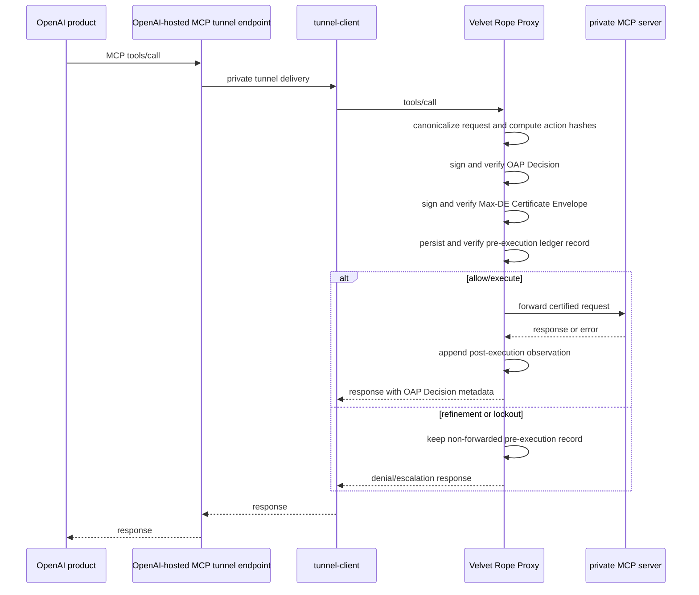

# OpenAI Secure MCP Tunnel Deployment

## Topology

```text
OpenAI product
  -> OpenAI-hosted MCP tunnel endpoint
  -> tunnel-client inside customer network
  -> Velvet Rope Proxy
  -> private MCP server
```

Velvet must sit between the tunnel client and the private MCP server. The tunnel provides private reachability. It is not liability-grade authorization proof. Velvet provides pre-execution admission, OAP Decision emission, the Velvet-signed Max-DE Certificate Envelope, and durable pre-execution ledger persistence before any upstream `tools/call`.

## Sequence



## Config

Set transport metadata in the proxy config:

```yaml
oap:
  require_max_de_certificate: true
  require_max_de_for_all_tool_calls: true
  allow_missing_max_de_in_development: false
  transport_context:
    kind: mcp
    openai_secure_mcp_tunnel:
      enabled: true
      tunnel_id_env: VELVET_OPENAI_TUNNEL_ID
      workspace_id_env: VELVET_OPENAI_WORKSPACE_ID
      connector_subject_env: VELVET_CONNECTOR_SUBJECT
```

Configure the private MCP upstream boundary so only Velvet has the credential
and client identity needed to call the private server:

```yaml
upstream:
  endpoint: https://private-mcp.default.svc.cluster.local:8443/mcp
  boundary:
    required: true
    require_bearer: true
    require_mtls: true
    bearer:
      header_name: Authorization
      scheme: Bearer
      token_env: VELVET_PRIVATE_MCP_UPSTREAM_TOKEN
    mtls:
      identity_pem_env: VELVET_PRIVATE_MCP_CLIENT_IDENTITY_PEM
      ca_bundle_pem_env: VELVET_PRIVATE_MCP_CA_BUNDLE_PEM
```

The values of `VELVET_OPENAI_TUNNEL_ID`, `VELVET_OPENAI_WORKSPACE_ID`, and `VELVET_CONNECTOR_SUBJECT` are hashed before being written to the Max-DE envelope or ledger. Raw tunnel, workspace, and connector subject identifiers must not appear in signed proof objects.

## Deployment Patterns

- Kubernetes sidecar: run the tunnel client and Velvet in the same pod; configure the tunnel client upstream URL as `http://127.0.0.1:8791/mcp`; configure Velvet upstream as an HTTPS private MCP service.
- Kubernetes gateway: run Velvet as an internal service between the tunnel-client deployment and an HTTPS private MCP service.
- Docker Compose: attach tunnel-client only to the tunnel network, private MCP only to the private MCP network, and Velvet to both.
- VM/systemd: run the tunnel client and Velvet as separate services; point the tunnel client to Velvet on localhost and Velvet to the private MCP server.

In sidecar topology, containers in one Kubernetes pod share a network namespace.
Pod-level NetworkPolicy cannot isolate the tunnel-client container from the
Velvet container. The private MCP server must enforce Velvet-only bearer plus
mTLS identity in that topology.

Velvet's Streamable HTTP upstream leg requires `https://` by default. Plaintext
upstreams are only for explicit loopback tests with
`http.allow_plaintext_loopback_upstream: true`.

## No-Bypass Contract

The tunnel must terminate at Velvet, not at the private MCP server. A production
deployment must enforce all of the following:

- The agent and tunnel client do not have raw upstream MCP credentials.
- The private MCP server accepts only the Velvet upstream bearer credential and
  Velvet mTLS/workload identity.
- Direct agent-to-private-MCP paths are blocked by network policy, security
  groups, service mesh policy, firewall rules, or equivalent controls.
- `tunnel-client -> private MCP server -> Velvet logging` is not
  authorization, because it records after execution instead of enforcing before
  execution.

For VM/systemd deployments, configure host firewall rules or service mesh
policy so the tunnel-client service can connect only to Velvet, and configure
the private MCP server to accept only Velvet's upstream bearer plus mTLS client
certificate. The systemd unit hardening does not by itself enforce network
topology.

## Failure Modes

| Failure | Velvet behavior |
|---|---|
| Signer unavailable | Fail closed before upstream execution; no forwarding. |
| Ledger unavailable | Fail closed before upstream execution; no forwarding. |
| Tunnel unavailable | No request reaches Velvet; no Velvet proof is emitted. |
| Upstream MCP unavailable | Pre-execution record remains durable; post-execution observation records failure. |
| Max-DE refinement | Pre-execution record is persisted; request is not forwarded. |
| Certified lockout | Pre-execution record is persisted; request is not forwarded. |

Do not deploy `tunnel-client -> private MCP server -> Velvet logging`. That topology records after execution and does not provide pre-execution authorization. The required topology is `tunnel-client -> Velvet -> private MCP server`.
